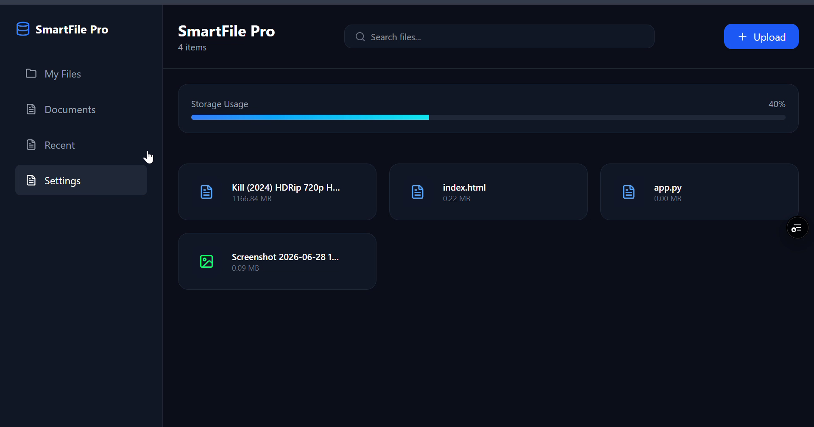
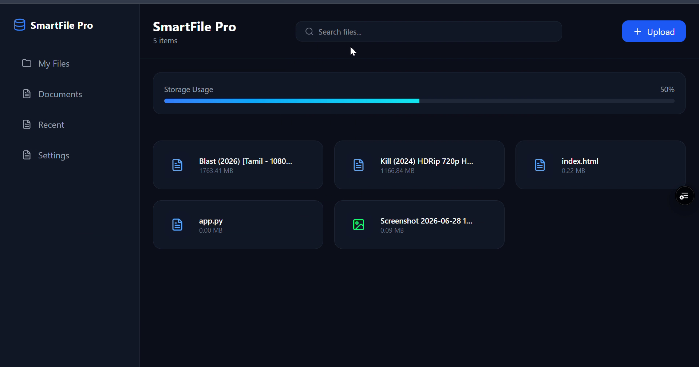
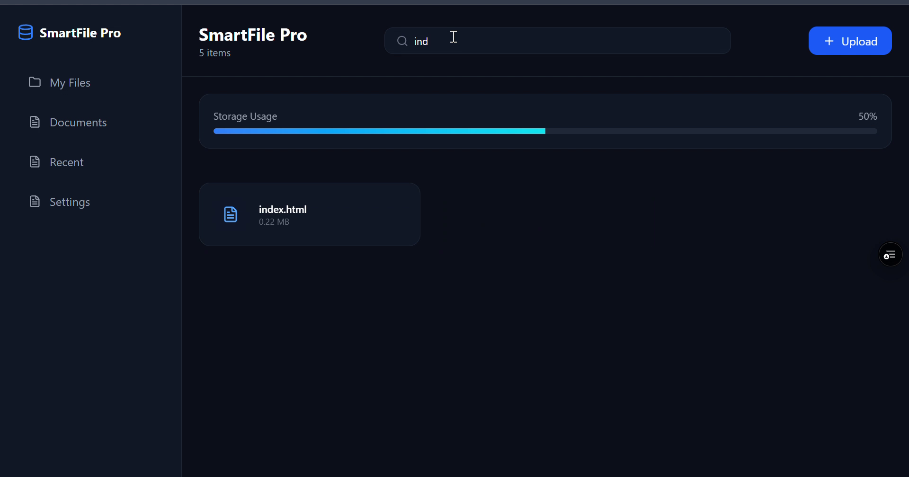
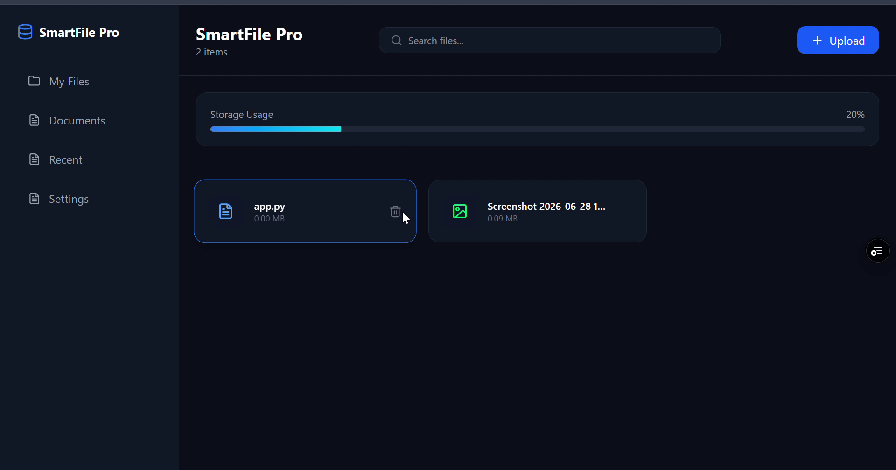
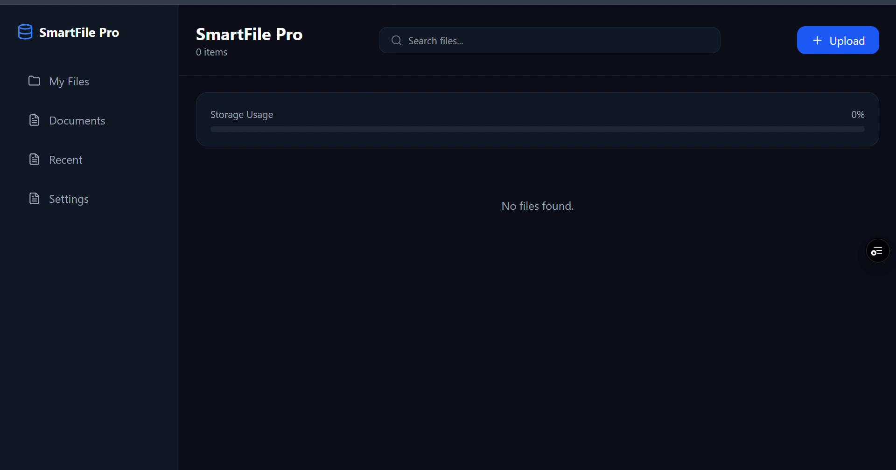

<div align="center">

# 📁 Smart File Organizer

### A modern and responsive file-management web application built with React and Vite

[](https://react.dev/)
[](https://vite.dev/)
[](https://developer.mozilla.org/en-US/docs/Web/JavaScript)
[](https://smart-file-organizer-sepia.vercel.app)

[🌐 Live Demo](https://smart-file-organizer-sepia.vercel.app) •
[💻 GitHub Repository](https://github.com/ashik-codex/smart-file-organizer)

</div>

---

## 📌 Overview

**Smart File Organizer** is a frontend file-management application that allows users to upload, search, view and remove file records through a clean and responsive dashboard.

The project was created to practise React state management, browser storage, reusable interface components and responsive web design.

File records are stored locally in the browser using **LocalStorage**, allowing the uploaded-file list to remain available after refreshing the page.

---

## ✨ Features

- 📤 Upload files from the user's device
- 🔍 Search uploaded files instantly
- 🗑️ Delete individual file records
- 💾 Save file information using browser LocalStorage
- 🔄 Preserve the file list after page refresh
- 📊 Display storage usage information
- 📄 Show file names, types and sizes
- 🧭 Simple sidebar navigation
- 📱 Responsive interface for different screen sizes
- 🎨 Clean and modern dashboard design
- 📭 Helpful empty state when no files are available

---

## 📸 Screenshots

### Dashboard Overview

The main dashboard provides a clean overview of uploaded files and storage information.



---

### File Upload

Users can select and add files through the upload interface.



---

### Instant Search

Uploaded files can be filtered immediately using the search field.



---

### File Management

Users can remove unwanted file records directly from the file list.



---

### Empty State

A clear empty-state interface is displayed when no files are available.



---

## 🛠️ Tech Stack

| Technology | Purpose |
|---|---|
| React | User interface and component-based development |
| Vite | Development server and production build tool |
| JavaScript | Application logic and interactivity |
| HTML5 | Application structure |
| CSS3 | Styling and responsive layout |
| LocalStorage | Browser-based data persistence |
| Vercel | Live deployment and hosting |

---

## ⚙️ How It Works

1. The user selects a file using the upload option.
2. The application reads the file information.
3. A file record is added to the React state.
4. The updated file list is saved in browser LocalStorage.
5. The application restores the saved records after page refresh.
6. The search field filters matching file names instantly.
7. A file record can be removed using the delete action.

> **Note:** This is currently a frontend project. The application stores file records locally in the browser and does not upload files to a cloud server.

---

## 🚀 Getting Started

### Prerequisites

Install the following tools before running the project:

- [Node.js](https://nodejs.org/)
- npm
- Git

### Clone the Repository

```bash
git clone https://github.com/ashik-codex/smart-file-organizer.git
```

### Open the Project Folder

```bash
cd smart-file-organizer
```

### Install Dependencies

```bash
npm install
```

### Start the Development Server

```bash
npm run dev
```

Open the local URL shown in the terminal, usually:

```text
http://localhost:5173
```

---

## 📦 Production Build

Create an optimized production build:

```bash
npm run build
```

Preview the production build locally:

```bash
npm run preview
```

---

## 📂 Project Structure

```text
smart-file-organizer/
├── public/
├── screenshots/
│   ├── 01_dashboard_overview.png
│   ├── 02_upload_success.png
│   ├── 03_search_feature.png
│   ├── 04_delete_action.png
│   └── 05_empty_state.png
├── src/
├── .gitignore
├── README.md
├── eslint.config.js
├── index.css
├── index.html
├── package.json
├── package-lock.json
└── vite.config.js
```

---

## 💾 Data Storage

The application uses browser **LocalStorage** for persistence.

This means:

- File records remain after refreshing the page
- Data is stored only in the current browser
- Clearing browser storage removes the saved records
- Data is not synchronized between devices
- No backend database is currently connected

---

## ⚠️ Current Limitations

- No user authentication
- No backend server
- No cloud file storage
- No synchronization between devices
- No automatic file categorization
- No file preview system
- Browser storage is limited compared with a database or cloud-storage service

---

## 🔮 Future Improvements

- 🔐 User authentication
- ☁️ Cloud-storage integration
- 🗄️ Backend and database support
- 🤖 AI-powered file categorization
- 🏷️ File tags and custom folders
- ↕️ Advanced sorting and filtering
- 👁️ File preview support
- 📥 Download and restore options
- 🔗 Multi-device synchronization
- 🌙 Dark and light theme support

---

## 🎯 Learning Outcomes

Building this project helped me practise:

- React components
- React state management
- Event handling
- File-input handling
- LocalStorage integration
- Search and filtering logic
- Responsive interface development
- Git and GitHub workflow
- Vercel deployment

---

## 🌐 Deployment

The project is deployed on Vercel.

**Live Application:**

https://smart-file-organizer-sepia.vercel.app

---

## 👨‍💻 Author

**Muhammed Ashik H**

- GitHub: [@ashik-codex](https://github.com/ashik-codex)
- Portfolio: [ashik-codex.github.io](https://ashik-codex.github.io/)

---

## ⭐ Support

If you found this project useful, consider giving the repository a star.

<div align="center">

**Built with React, Vite and continuous learning.**

</div>
